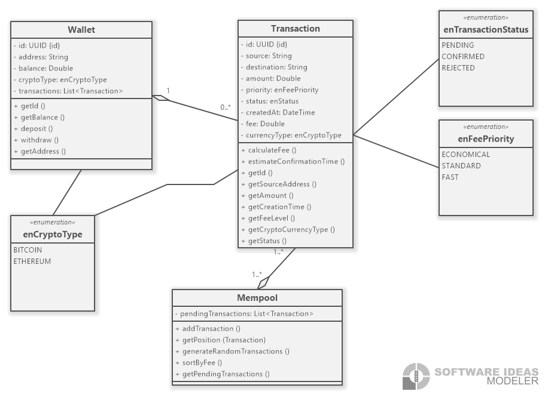

# Crypto Wallet Simulator

A Java-based cryptocurrency wallet simulation application that allows users to create wallets, manage balances, and perform transactions with Bitcoin and Ethereum.

## Features

- **Multi-Currency Support**: Create and manage Bitcoin and Ethereum wallets
- **Wallet Management**: Create new wallets with unique addresses and track balances
- **Transaction Processing**: Send cryptocurrency between wallets with balance validation
- **Database Persistence**: All wallets and transactions are stored in a SQL database
- **Address Validation**: Validates wallet addresses based on cryptocurrency type
- **Interactive CLI**: User-friendly command-line interface for all operations

## Project Structure

```
src/
├── Main.java                          # Application entry point
├── model/
│   ├── CryptoCurrencyType.java       # Enum for supported cryptocurrencies
│   ├── Transaction.java              # Transaction data model
|   ├── FeeLevel.java                 # Enum for Fee Priority Levels
|   ├── TransactionStatus.java        # Enum for Transaction Status
│   └── Wallet.java                   # Wallet data model
├── repository/
│   ├── DatabaseConnectionManager.java # Database connection handling
│   ├── Repository.java               # Generic repository interface
│   ├── TransactionRepository.java    # Transaction data access
│   └── WalletRepository.java         # Wallet data access
├── service/
│   ├── TransactionService.java       # Transaction business logic
│   └── WalletService.java           # Wallet business logic
│   └── Mempool.java                 # Mempool business logic
│   └── WalletService.java
├── ui/
│   └── MainMenu.java                # Command-line user interface
└── util/
    └── AddressValidator.java        # Wallet address validation utilities
```

## Technologies Used

- **Java 8+**: Core programming language
- **JDBC**: Database connectivity
- **PostgreSQL Database**: Data persistence
- **Logging**: Java.util.logging for application logging

## Prerequisites

- Java Development Kit (JDK) 8 or higher
- PostgreSQL Database 
- JDBC driver for your chosen database

## Setup and Installation

1. **Clone the repository**
   ```bash
   git clone <repository-url>
   cd Crypto_Wallet_Simulator
   ```

2. **Database Setup**
   - Create a database for the application
   - Update database connection settings in `DatabaseConnectionManager.java`
   - Create the required tables:

   ```sql
   CREATE TABLE wallets (
       id UUID primary key default uuid_generate_v4(),
       address VARCHAR(255) NOT NULL,
       balance DOUBLE precision NOT NULL,
       type VARCHAR(50) NOT NULL
   );

   CREATE TABLE transactions (
       id UUID primary key default uuid_generate_v4(),
       source_address varchar(100) not null,
       destination_address varchar(100) not null,
       amount double precision not null,
       creation_date TIMESTAMP not null,
       fees double precision not null,
       fee_level varchar(50) not null,
       crypto_currency_type varchar(50) not null
   );
   ```

### Main Menu Options

1. **Create a new Crypto Wallet**: Generate a new wallet for Bitcoin or Ethereum
2. **Select an existing Wallet**: Display all created wallets with their balances to select from
3. **Create a new Transaction**: Creat a Transaction to transfer cryptocurrency between wallets
4. **View my transaction's position in Mempool**: View the selected transaction's position in Mempool
5. **Consult current Mempool state**: Show Mempool state
0. **Exit**: Close the application

### Creating a Wallet

1. Select option 1 from the main menu
2. Choose cryptocurrency type (Bitcoin or Ethereum)
3. A new wallet will be created with a unique address and zero balance

### Making a Transaction

1. Select option 3 from the main menu
2. Enter destination wallet Address
3. Enter transaction amount
4. The system will validate and process the transaction

## Address Formats

- **Bitcoin**: (bc1...) formats
- **Ethereum**: Standard 0x prefixed 30-character hexadecimal addresses

## Error Handling

The application includes comprehensive error handling for:
- Invalid wallet addresses
- Insufficient balances
- Non-existent wallets
- Database connection issues
- Invalid transaction amounts

## Logging

Application events are logged using Java's built-in logging framework. Logs include:
- Wallet creation and updates
- Transaction processing
- Database operations
- Error conditions

## Class Diagram (UML)


## Contact

For questions or support, please contact [saadelquaul@gmail.com]

---

**Note**: This is a simulation application for educational purposes.
